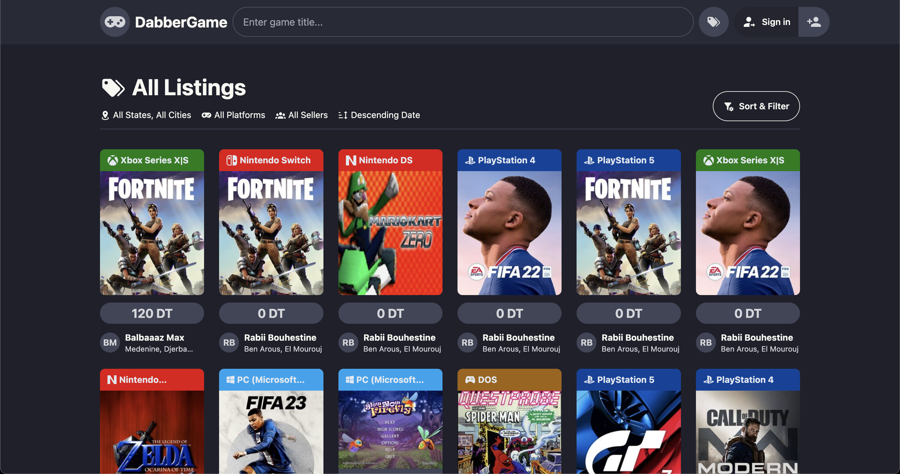

# dabbergame.tn

dabbergame.tn is a modern, lightweight videogames marketplace built with [Svelte](https://svelte.dev/), [Tailwind CSS](https://tailwindcss.com/), and [Vite](https://vitejs.dev/). The platform offers a seamless and responsive user experience for browsing and purchasing games.



## 🚀 Quick Start

To get started with dabbergame.tn locally, follow these steps:

### Prerequisites

Ensure you have the following installed:

- [Node.js](https://nodejs.org/) (version 16 or higher)
- [npm](https://npmjs.com/) (comes with Node.js)

### Installation

Clone the repository and install dependencies:

```bash
git clone https://github.com/rabiibouhestine/dabbergame.tn.git
cd dabbergame.tn
npm install
```

### Development

Start the development server:

```bash
npm run dev
```

Your application will be available at [http://localhost:5173](http://localhost:5173).

### Build

To create a production build:

```bash
npm run build
```

The build artifacts will be output to the `dist/` directory.

## 🌍 Technologies Used

- **Svelte**: A modern JavaScript framework for building fast and reactive user interfaces.
- **Tailwind CSS**: A utility-first CSS framework for rapid UI development.
- **Vite**: A next-generation, fast build tool and development server.

## 📜 License

This project is licensed under the MIT License - see the [LICENSE](LICENSE) file for details.

## 📣 Contact

For inquiries or contributions, please open an issue or submit a pull request on the [GitHub repository](https://github.com/rabiibouhestine/dabbergame.tn).

